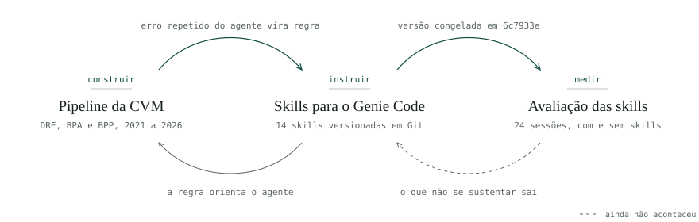
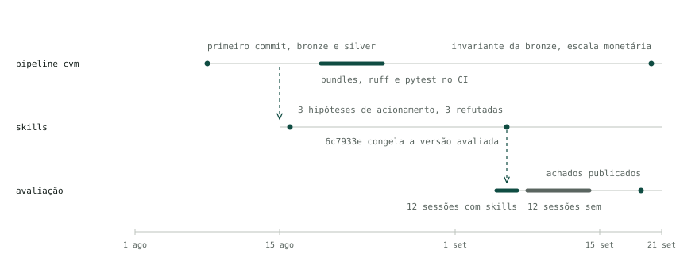

Engenharia de dados em Databricks, com um agente de código no processo.

Os três repositórios abaixo são um pipeline, as regras que escrevi para o agente trabalhar nele e um experimento que mede se essas regras mudam o resultado.

<picture>
  <source media="(prefers-color-scheme: dark)" srcset="assets/ecossistema-dark.svg">
  
</picture>

### [Pipeline da CVM](https://github.com/1pedroosilva/projeto-cvm-dados-financeiros)

Demonstrações financeiras anuais das companhias abertas, do ZIP que a CVM publica até tabelas Silver em Delta Lake. O layout da fonte muda entre anos e a companhia republica valores corrigidos sem aviso, por isso a Bronze guarda toda versão e a Silver resolve a vigente na leitura. Captura, histórico e tratamento já rodam; a Gold ainda não existe. Jobs e ambientes declarados em Asset Bundles, Ruff e pytest a cada push.
[Etapa por etapa, no portfólio.](https://1pedroosilva.github.io/projeto-cvm/)

### [Skills para o Genie Code](https://github.com/1pedroosilva/databricks-genie-skills)

14 skills para o que as nativas não cobrem: estratégia de gravação, nomenclatura, onde nasce um arquivo novo, como revisar um notebook. Cada uma saiu de um erro que o agente repetia no pipeline da CVM. No começo nenhuma era acionada. Testei três hipóteses sobre a causa, uma por vez, e as três caíram ([protocolo](https://github.com/1pedroosilva/databricks-genie-skills/blob/main/docs/protocolo_teste_empirico.md)).
[O projeto, no portfólio.](https://1pedroosilva.github.io/projeto-databricks-skills/)

### [Avaliação das skills](https://1pedroosilva.github.io/genie-skills-eval/)

Um pipeline sobre dados de interrupção de energia da ANEEL, construído duas vezes no mesmo workspace: com as skills congeladas em [`6c7933e`](https://github.com/1pedroosilva/databricks-genie-skills/tree/6c7933e) e com elas desligadas. Os mesmos 12 pedidos, na mesma ordem, em 24 sessões com transcrição completa e o raciocínio do agente. Com o primeiro de dois temas fechado, as skills acertam onde o arquivo nasce e que nome ele recebe. Nenhum dos dois braços percebeu que escrevia num catálogo inexistente.
[As 24 sessões.](https://1pedroosilva.github.io/genie-skills-eval/aneel/)

<picture>
  <source media="(prefers-color-scheme: dark)" srcset="assets/linha-do-tempo-dark.svg">
  
</picture>

Datas tiradas dos commits dos três repositórios.

### Para ler primeiro

- [`evolucao_projeto.md`](https://github.com/1pedroosilva/projeto-cvm-dados-financeiros/blob/main/00_documentacao/evolucao_projeto.md): as decisões do pipeline com data, inclusive as que voltaram atrás, e o motivo de cada volta.
- [`6b104fc`](https://github.com/1pedroosilva/databricks-genie-skills/commit/6b104fc): o agente acrescentou 48 linhas ao próprio arquivo de instruções, que proíbe exatamente isso. O commit seguinte desfaz.
- [`lessons_learned.md`](https://github.com/1pedroosilva/databricks-genie-skills/blob/main/docs/lessons_learned.md): uma correlação que entrou na documentação como requisito e saiu depois de testada.

Databricks, PySpark, Delta Lake, Unity Catalog, Asset Bundles, GitHub Actions, pytest, Ruff.

[portfólio](https://1pedroosilva.github.io/) &nbsp; [linkedin](https://www.linkedin.com/in/1pedroosilva/) &nbsp; [e-mail](mailto:1pedro.osilva@gmail.com)
